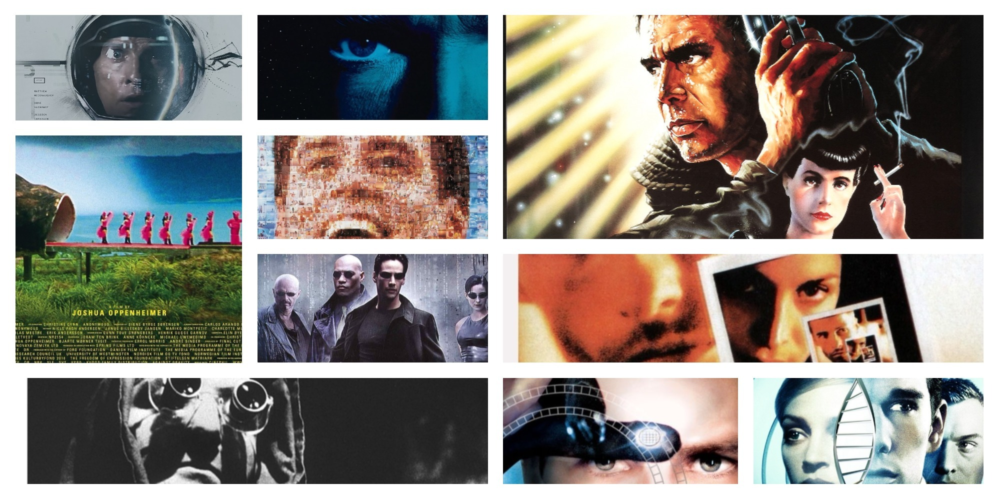

[gimmick:theme](united)

# Philosophy and film

## Course description 

Can film be a credible way of doing philosophy? Is philosophy done in film in the way that it is done in the classroom and in writing? Can films be philosophical exercises themselves? Is film a form of philosophizing? How should we philosophically approach films? The main aim of the course is to develop language skills in English while at the same time studying these and other philosophical problems around film. The student’s philosophical study will be guided by two broad kinds of problems: philosophical problems in films or motivated by them and philosophical problems about film as a way to philosophize. The student’s language skills in English will be developed by the active use of the language in written and oral discussion, the writing of short texts and the comprehension of lectures, films and texts. 

*Lecturer:* [Juan Camilo Espejo-Serna](http://jcunisabana.github.io/)

*Email:* juan.espejo1@unisabana.edu.co

*Time:* 10am - 1pm 

*Room:* Atellier 105

*Website:* http://jcunisabana.github.io/philandfilm

##Learning outcomes

- The student produces short texts in English.

- The student plans philosophical essays in English.

- The student understands key philosophical issues introduced by films and of film as a way of philosophizing.

- The student understands the core elements of lectures, films and texts in English.

-   The student uses ICTs to support their learning of English and philosophy.

##Assessment

 Unjustified late submissions will **always** be marked down 0.5 units per day.

|Module|Activity|Percentage|
| --- | --- | --- |
|1|    Weekly task            |15%
|    1 |   Skeptical scenario 1                               |    15%
 |    2 |     Weekly task                            |   15%
|     2 |     Skeptical scenario 2                             |  15%
 |    3 |    Essay plan   |    10%
  |   3  |   Short Essay         |           30%

